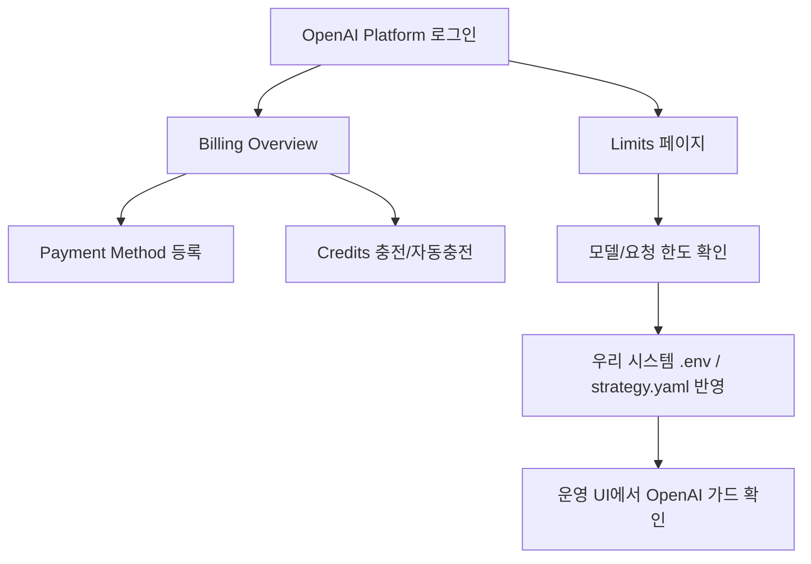

# OpenAI 충전/한도 설정 가이드 (일반 사용자용)

기준일: 2026-02-28

이 문서는 "과금 사고 없이" OpenAI API를 쓰기 위한 최소 절차를 설명합니다.

## 1) 먼저 알아둘 핵심

- 우리 시스템은 기본값이 `OPENAI_PAID_ALLOWED=false`입니다.
- 이 값이 `true`가 아니면 OpenAI 유료 호출은 자동 차단됩니다.
- 추가로 `strategy.yaml`의 `gpt_scout.quota_guard`가 일/월 호출수와 월 예산을 한 번 더 막아줍니다.

## 2) OpenAI 콘솔에서 충전/결제 설정

### Step A. Billing 화면 열기

1. OpenAI Platform 로그인
2. Billing Overview 이동: `https://platform.openai.com/settings/organization/billing/overview`

### Step B. 결제수단 등록

1. Billing 페이지에서 결제수단(Payment method) 추가
2. 법인/개인 카드 등록
3. 등록 완료 후 결제 프로필 상태 확인

### Step C. 크레딧(선충전) 관리

1. Credits 페이지 이동: `https://platform.openai.com/settings/organization/billing/credits`
2. `Add to balance` 또는 자동충전(Auto-recharge) 설정
3. 충전 후 잔액(Balance)과 다음 자동충전 조건 확인

## 3) 사용량/한도(Usage limits) 설정

### Step D. 모델별/조직 한도 확인

1. Limits 페이지 이동: `https://platform.openai.com/settings/organization/limits`
2. 사용 모델과 RPM/TPM/예산 관련 제한 확인
3. 필요 시 한도 상향 신청(승인 기반)

### Step E. Help 문서로 정책 확인

- API Usage Limits 설명: `https://help.openai.com/en/articles/5955598-is-api-usage-subject-to-any-rate-limits`
- Billing collection(공식): `https://help.openai.com/en/collections/3943089-billing`

## 4) 우리 자동매매 시스템에 안전하게 반영

`.env`에서 기본 안전값 유지:

```env
OPENAI_PAID_ALLOWED=false
```

유료 호출을 허용할 때만 다음처럼 변경:

```env
OPENAI_PAID_ALLOWED=true
```

`strategy.yaml` 권장값 예시:

```yaml
gpt_scout:
  quota_guard:
    enabled: true
    require_paid_opt_in: true
    paid_opt_in_env: "OPENAI_PAID_ALLOWED"
    max_requests_per_day: 3
    max_requests_per_month: 40
    max_monthly_cost_usd: 5.0
    reserve_ratio: 0.9
```

## 5) UI에서 바로 확인하는 방법

운영상태 탭에서 `OpenAI 쿼터/과금 가드`를 확인하세요.

- 오늘 호출 / 이번달 호출
- 이번달 비용(USD)
- 유료 호출 허용(허용/차단)
- 최근 가드 사유(예: `OPENAI_PAID_OPT_IN_REQUIRED`, `OPENAI_HTTP_429`)
- OpenAI 재시도 가능 시각(KST/UTC)

## 6) 문제 해결 빠른 체크

- `OPENAI_HTTP_429`: 쿼터/요금제/한도 문제 가능성 큼
- `OPENAI_PAID_OPT_IN_REQUIRED`: `.env`에 `OPENAI_PAID_ALLOWED=true` 필요
- `OPENAI_GUARD_MONTHLY_BUDGET`: `strategy.yaml` 월 예산 상한 도달

## 7) 메뉴 지도(그림)



## 8) 공식 화면 예시 이미지

### Billing Overview 예시


### Billing Usage Limits 예시


