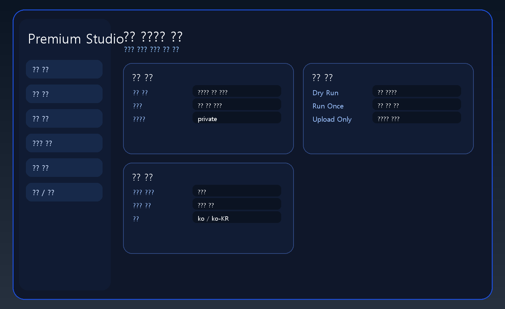
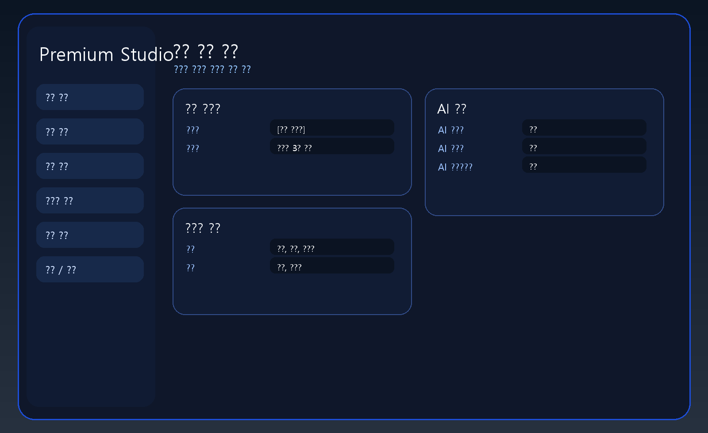
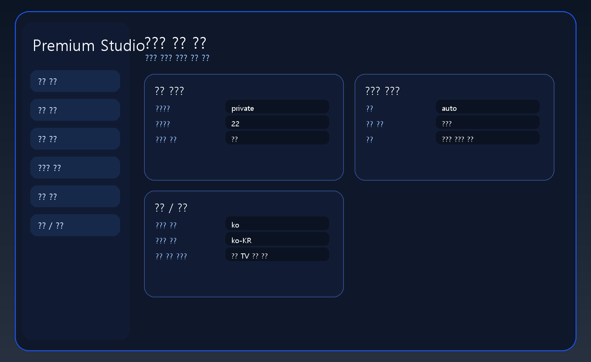
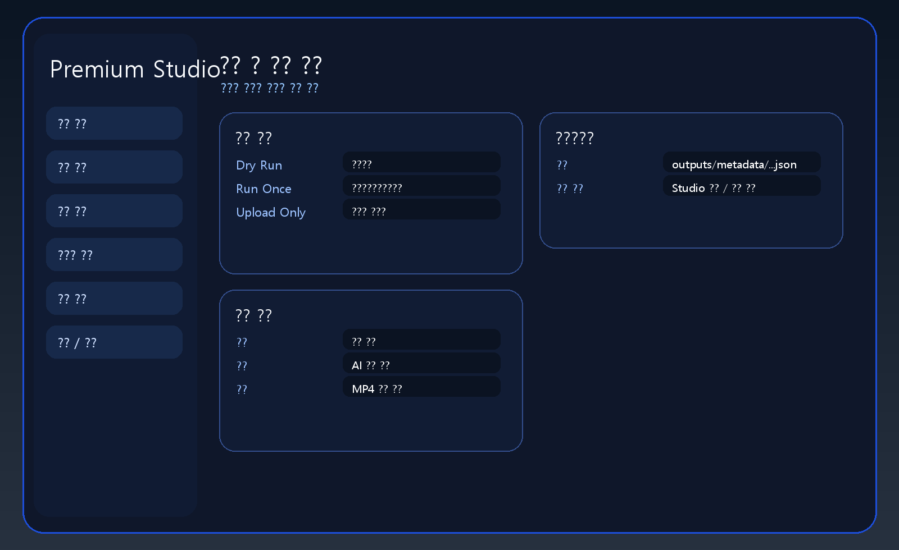

# 설정 프로그램 사용 매뉴얼

이 문서는 `youtube_trend_automation` 의 Studio 프로그램을 일반 사용자도 바로 사용할 수 있게 정리한 안내서입니다.

## 1. 프로그램으로 할 수 있는 일

- 유튜브 채널을 여러 개 등록
- 채널별 생성 규칙과 업로드 설정 관리
- 자동 업로드 주기 변경
- 원격 접속 주소 관리
- Quick Tunnel 임시 주소 사용
- Named Tunnel 고정 도메인 사용
- 수동 제목/설명/배경/썸네일 대체
- 버튼 한 번으로 1회 생성/업로드 실행

## 2. 실행 방법

### Windows

```powershell
cd youtube_trend_automation
.\launch_studio.ps1
```

또는 EXE 버전:

```powershell
cd youtube_trend_automation
powershell -ExecutionPolicy Bypass -File .\build_studio_exe.ps1
.\dist\YouTubeAutomationStudio\YouTubeAutomationStudio.exe
```

## 3. 접속 주소 이해하기



- `Local`: 지금 이 PC에서 여는 주소
- `LAN`: 같은 와이파이/사무실 네트워크 안 다른 기기용 주소
- `Remote`: 외부 다른 장소의 PC/태블릿/휴대폰용 주소

주소는 아래 두 곳에도 저장됩니다.

- `data\runtime\studio_access.txt`
- EXE 폴더의 `StudioAccess.txt`

## 4. 자동 업로드 방식

- 기본 자동 업로드 주기는 `6시간`
- Studio UI의 `자동화 / 원격 접속` 탭에서 시간 변경 가능
- 저장하면 서버 설정 파일을 동기화하고 서버 서비스를 재시작
- 정기 업로드는 Ubuntu 서버에서만 실행
- 로컬 Windows는 설정 변경과 수동 1회 업로드만 담당
- 로컬 작업 스케줄러는 제거된 상태가 정상

기존 로컬 작업 스케줄러를 삭제하려면:

```powershell
powershell -ExecutionPolicy Bypass -File .\deploy\remove_windows_scheduler.ps1
```

## 5. 고정 도메인 Cloudflare Tunnel

### Quick Tunnel

- 별도 준비 없이 바로 사용 가능
- 단점: `Remote` 주소가 실행할 때마다 바뀜

### Named Tunnel

- 장점: `https://studio.example.com` 같은 고정 주소 사용 가능
- 필요 값:
  - 고정 도메인 호스트명
  - Tunnel Token

Studio 안에서 설정하는 위치:

- `자동화 / 원격 접속`
- `원격 접속 방식` -> `고정 도메인 Named Tunnel`
- `고정 도메인 호스트명`
- `Tunnel Token`

토큰이 아직 없으면 아래 스크립트를 먼저 실행합니다.

```powershell
powershell -ExecutionPolicy Bypass -File .\deploy\setup_cloudflare_named_tunnel.ps1 -Hostname studio.example.com -TunnelName youtube-automation-studio
```

이 스크립트가 끝나면:

- named tunnel 생성
- DNS 연결
- token 발급
- Studio 설정 파일 반영

그 다음 Studio를 다시 열면 `Remote` 주소가 고정 도메인으로 바뀝니다.

## 6. 채널 설정



- 표시용 채널 이름
- 실제 유튜브 채널명
- 유튜브 채널 ID
- 프리셋 선택
- 비주얼 스타일
- 목표 영상 길이

프리셋을 바꾸고 `선택한 프리셋 기본값 다시 적용` 을 누르면 기본 규칙이 다시 채워집니다.

## 7. 업로드 옵션



설정 가능 항목:

- 공개 범위
- 카테고리
- 아동용 아님
- 동영상 언어
- 오디오 언어
- 변경된 콘텐츠 자동 판단
- OAuth 경로

## 8. 자동화 / 원격 접속 탭

이 탭에서 변경하는 핵심 항목:

- 자동 업로드 간격(시간)
- 로컬 자동 업로드 제거 상태 확인
- 원격 접속 사용 여부
- Quick / Named 모드 선택
- Tunnel 이름
- 고정 도메인 호스트명
- Tunnel Token

## 9. 수동 대체

- 수동 제목
- 수동 설명
- 수동 배경 이미지 경로
- 수동 썸네일 이미지 경로
- 수동 프롬프트

비워 두면 자동 생성값이 사용됩니다.

## 10. 실행 / 로그



버튼 설명:

- `Dry Run`: 실제 업로드 없이 결과만 확인
- `Generate + Upload Once`: 한 번 생성하고 업로드
- `Render Only`: 렌더만 다시 실행
- `Upload Only`: 이미 만든 영상만 업로드

## 11. 운영 권장 순서

1. 채널과 프리셋을 맞춘다.
2. 자동 업로드 시간을 정한다.
3. Quick 또는 Named Tunnel을 정한다.
4. 저장한다.
5. `Generate + Upload Once` 로 1회 검증한다.
6. 만족하면 Studio를 닫고 자동 업로드에 맡긴다.

## 12. 관련 문서

- [youtube_auto_upload_manual_ko.md](c:/Users/happy/Desktop/박정근/주식/자동트레이드/AutoTrade-System/youtube_trend_automation/docs/youtube_auto_upload_manual_ko.md)
- [README.md](c:/Users/happy/Desktop/박정근/주식/자동트레이드/AutoTrade-System/youtube_trend_automation/README.md)
